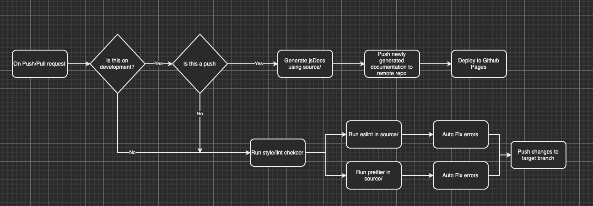

## piplines phase 1 status

The pipeline at the moment consists of 2 serperate actions:

### `docs.yml`
- triggers on push to the branch `development`
This action serves to generated jsDoc documentaion of the development branch. Developers branch off (in feature branches tagged by github issues) and make pull requests to this branch. When the action is triggered, it does the following:
1. Checks out origin/development to get the latest version
2. Generates jsDocs in the `docs/` directory, taking in the files in the `source/` directory as input
3. Pushes the newly created docs to a seperate public remote repo, where it will be hosted on github pages
   - The seperate public remote repo is essentaily "reset" everytime to make it sure it has the most recent iteration of documention

### `lint.yml`
- tiggers on push and pull request to ANY branch
This action serves to make lint/styles checks and automatically fix them. We are using eslint for linting and prettier for styling. `.eslint.json` and `.prettierrc.js` outlines our styling choices. When the action is triggered, it does the follwoing: 
1. Checks out whatever branch triggered the event
2. runs eslint and prettier (using our configerations) in the source directory
3. If any errors are found, the action will try to correct them automatically and create a serperate commit

### Diagram of pipeline

### Things to do
- We tried [codefactor.io](codefactor.io) to get out code graded, but we are running into problems where complains about our style that we defined in our prettier and eslint. Either we:
  -  try to configure codefactor with our own stlying (not sure if possible)
  -  change our stlying to match what codefactor likes (not ideal)
  -  look for other checkers (websites such as [codeacy](codeacy.com/pricing)), possibly [codeclimate](codeclimate.com)
- Implement some unit testing framework such as [jestjs.io](jestjs.io)
