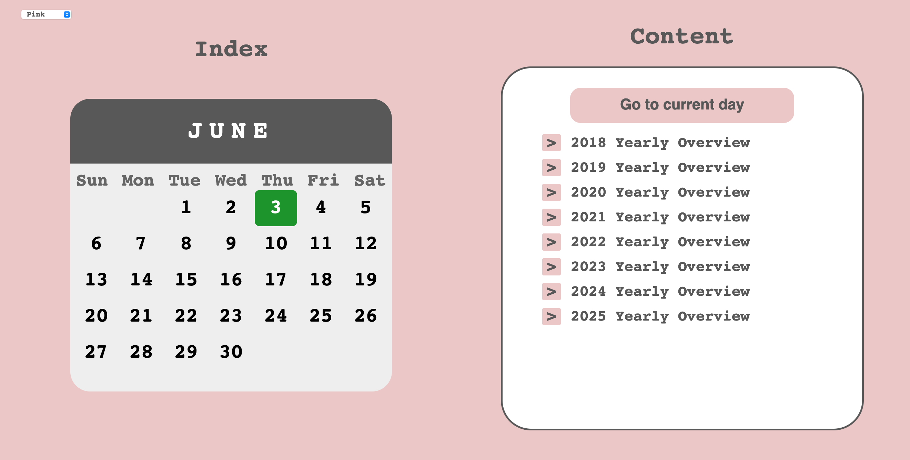
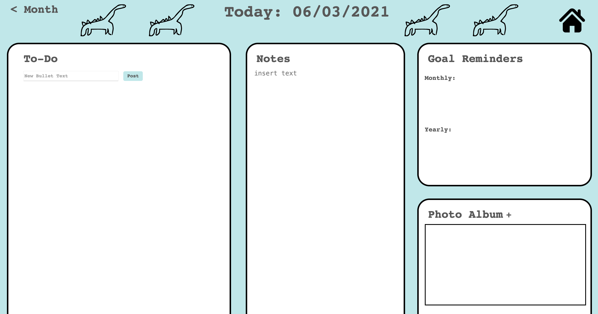

## Manual Tesing 6/3/2021 
Tester: Dustin 

Branch: `development`

MacBook Pro, Firefox, localhost server

### Notes
- tested account creation, made sure that you are aren't logged in all other pages route you back to login

- **BUG**  - User can create an account with a blank username and password (empty string) 

- tested index page routing, clicking on days/months/years brings you to correct URL, and screens correctly display the selected date

- monthly overview calender correctly doesn't highlight a day if the current day isn't displayed

- **feature request** - Picking a different color theme doesn't update the highlighted color of the current date. In the example below, the theme is pink but the calender highlight is green.

- tested bullet/goal creation, making a bullet and editing notes correctly stores to database, and is retreived correctly when you go to the particular date

- **BUG** - with 100% size, daily overview seems too big (requires scrolling)

- monthly goals display for the correct month that they were created in, yearly goals display for the correct year they were created in 

- **BUG** - svg images for bullet editing aren't showing correctly. People on chrome report it working fine, so require further testing once the repo is public and the site is live

- **BUG** - the photo album grows when certain pictures are loaded, and some pictures are cropped (not resizing properly?).

- Looked at how styling holds up for smaller window sizes, half window size, 60% screen size both looks good