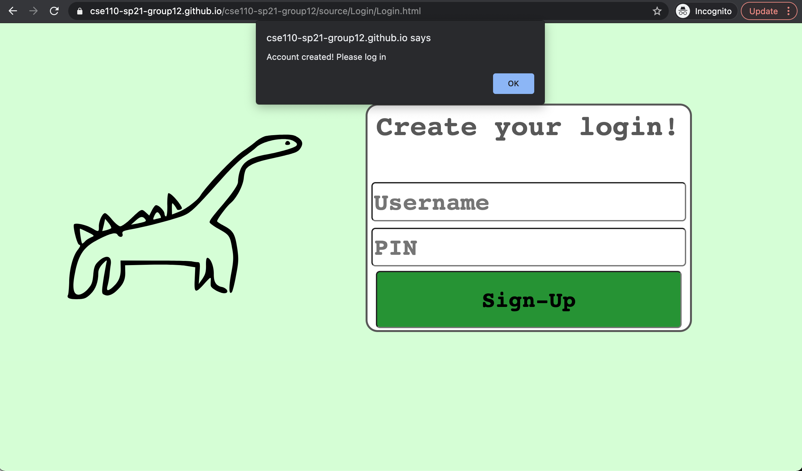
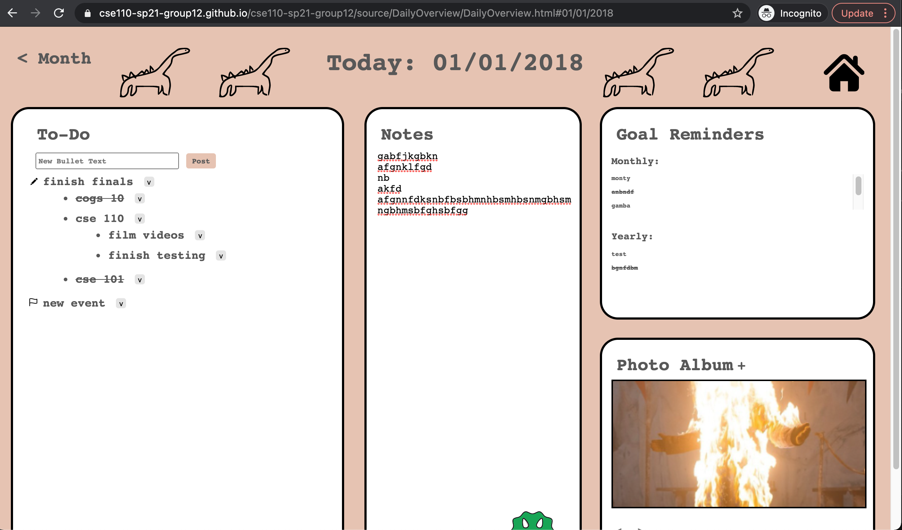
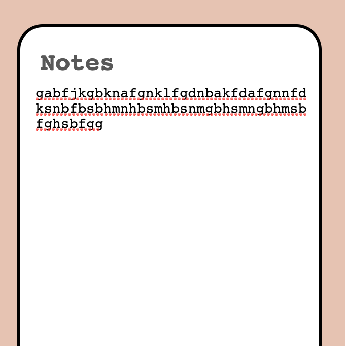
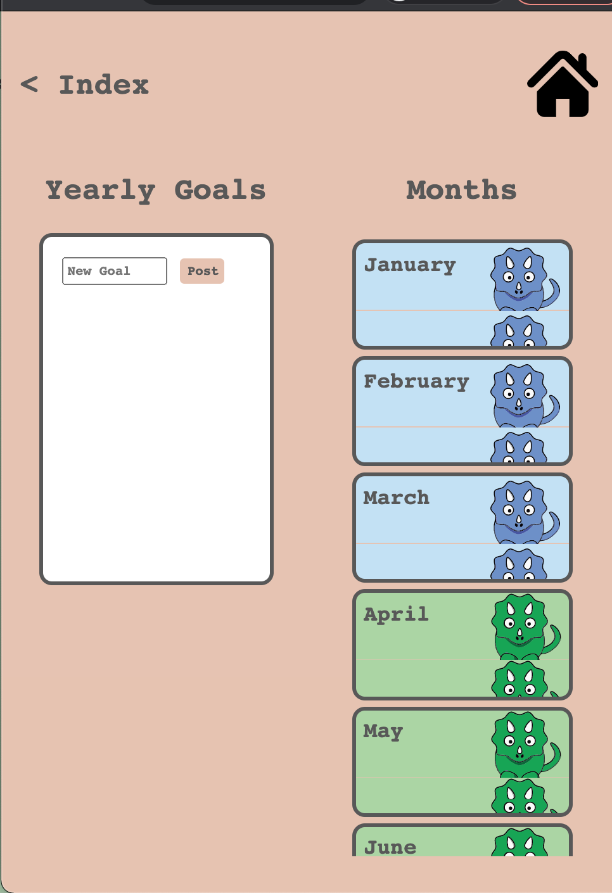

## Manual Testing 6/7/2021 
Tester: Hana 

Branch: `testing`

MacBook Pro, Chrome, deployed github pages

### Notes
- tested creating an account and routing all pages to login when a user isn't signed in
- **BUG** - user can still create an account with an empty username and password

- tested changing the theme background too all the different color options and that the theme changes persist between all pages and between login sessions
- all the routing between pages works
  - from index to corrent years/months from the dropdown and the calendar
  - from the yearly overview to the months and the index (back and home buttons)
  - from the monthly overview to the years from the back button, days from the calendar, index from the home button
  - from the daily overview to the month from the back button, index from the home button
- calendar correctlyonly highlight the current day with the selected theme color
- adding, editing, deleting, and marking as done for yearly goals works
- adding, editing, deleting, and marking as done for monthly goals works
- for daily page, monthly and yearly goals show up for corresponding month and year, with correct goals marked as done
- user can scroll through monthly and yearly goal overflows
- three levels of nesting for todo bullets, with the third level correctly not having the add button
- editing, adding child, deleting, marking as done, and adding bullet to collection all work
- user can add notes
  - overflows to next line if too long
- user can add photos and scroll through them
- **BUG** - some photos crop when uploaded to photo album (example photo is 659x658)

- **enhancement** - add a favicon tab icon with our logo

- **BUG** - daily page still requires scrolling at 100% view

- **BUG** - when leaving the daily overview and coming back to it, when reloading all the data, the notes section does not display the newlines

- **enhancement** - when view window has small width, the month height causes image overflow

